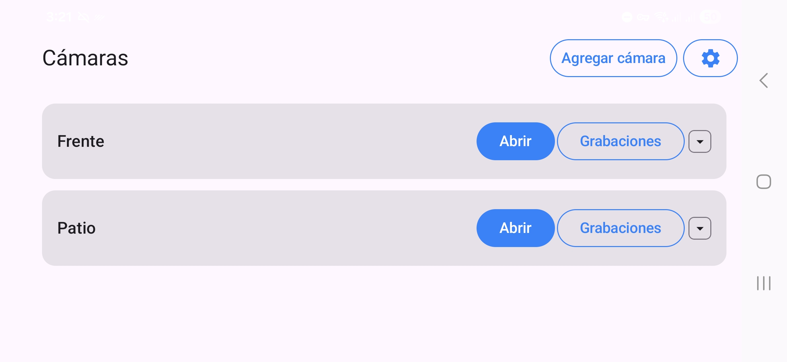

# CamMonitor Android

Cliente Android de `CamMonitor` para monitoreo y operación básica de cámaras IP, con enfoque en consumo de la API backend (`CamMonitor/Server`) y visualización de streams/eventos.

## Stack

- Kotlin
- Jetpack Compose
- Android SDK 24+ (target 36)
- Retrofit + Moshi (API HTTP)
- OkHttp
- EncryptedSharedPreferences (config sensible en dispositivo)
- GSYVideoPlayer (reproducción RTSP)

## Requisitos

- Android Studio (recomendado: versión reciente estable)
- JDK 11
- Android SDK instalado (minSdk 24, compileSdk 36)

## Build y ejecución

Desde `AndroidApp/`:

```bash
./gradlew :app:assembleDebug
```

APK debug generado en:

- `app/build/outputs/apk/debug/`

Tests unitarios:

```bash
./gradlew :app:testDebugUnitTest
```

## Configuración inicial en la app

En el primer arranque, la app muestra una pantalla de configuración:

1. **Backend URL** (ejemplo: `http://192.168.0.10:8080`)
2. **Backend API Key** (`X-Api-Key` del Server)
3. **Cámaras** (puedes agregar una o más):
   - Nombre
   - Usuario/contraseña
   - Host local
   - Puertos RTSP/ONVIF (local y remoto)

La configuración se guarda localmente usando `EncryptedSharedPreferences`.

## Nombres personalizados de presets PTZ

- Los nombres de posiciones PTZ se editan desde la UI (boton `★` -> `Editar`), por camara.
- Si no definis un nombre personalizado, la app muestra el nombre ONVIF reportado por la camara (o el token como ultimo fallback).
- Los aliases se guardan localmente en `EncryptedSharedPreferences`.
- Para compatibilidad con instalaciones antiguas, la app migra automaticamente una sola vez cualquier `preset_names.json` legado al almacenamiento local.

## Integración con backend (Server)

Este cliente consume, entre otros, estos endpoints:

- `GET /api/health`
- `GET /api/list`
- `GET /api/detections`
- `GET /api/detection_classes`
- `GET /api/detection_day_summary/video`
- `GET /media/{filename}`

Todos los endpoints protegidos requieren `X-Api-Key`.

## Notas de red y seguridad

- El proyecto permite tráfico HTTP claro para entornos LAN/ONVIF de laboratorio (`app/src/main/res/xml/network_security_config.xml`).
- Para despliegues públicos, se recomienda backend con HTTPS y hardening de transporte.
- No commitear secretos ni archivos locales (`local.properties`, credenciales reales, etc.).

## Estructura relevante

```text
AndroidApp/
  app/src/main/java/com/example/camara/
    MainActivity.kt
    SetupScreen.kt
    SecureConfigStore.kt
    recordings/
      api/RecApiClient.kt
      ui/RecordingsScreen.kt
      player/HttpPlayer.kt
```

## Estado actual

Proyecto funcional para demo end-to-end con [`cammonitor-server`](https://github.com/JoaquinV11/cammonitor-server):

- Compila en debug.
- Tests unitarios básicos disponibles.
- Configuración runtime de backend y cámaras desde UI.

## Capturas

### Pantalla principal


